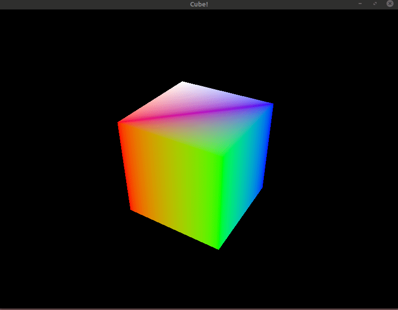

# Cube
Blood, sweat, and tears went into making this. I'll probably add a few improvements to solidify my understanding before moving on.

I want to add
 - [ ] User camera / movement
 - [ ] Multiple cubes
 - [ ] Texturing (maybe make the second cube be a die with die textures to label the faces?)

